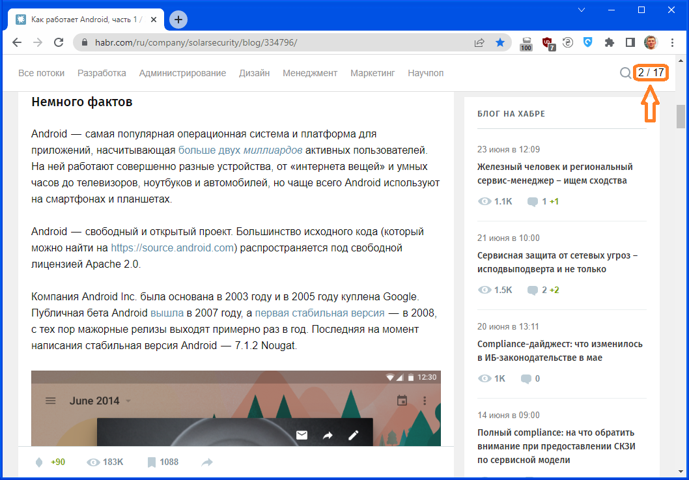

# SizeInScreens
SizeInScreens Chrome Extension - Show size of scrollable page in screen sises

Показать размер прокручиваемой страницы в размерах экрана.

Часто встречаются очень длинные страницы с целым полотном текста, или с большим количеством комментариев. Полоса прокрутки в таком случае очень узкая, и в результате непонятно, насколько велика полная длина страницы. 

Расширение замеряет высоту страницы, делит её на размер экрана (высоту окна вывода), и таким образом получает длину страницы в экранах. В таком же виде (в экранах) выводится текущее положение прокрутки.

Это помогает рассчитывать время, необходимое на прочтение статей. Если статья занимает 30 экранов, и по опыту установлено, что прочтение одного экрана занимает в среднем, например, 1 минуту, то на статью уйдёт приблизительно 30 минут.

Добавить виджет SizeInScreens можно на любую страницу через контекстное меню. Виджет появится в верхнем левом углу, но его можно переместить в любое место экрана.

Если задержать над виджетом указатель мыши, появится контекстное меню, через которое можно включить отображение этого виджета всегда на этом сайте.